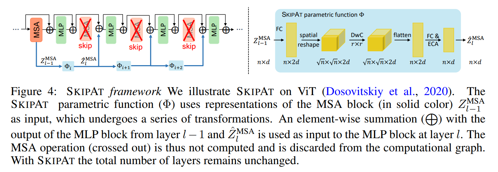
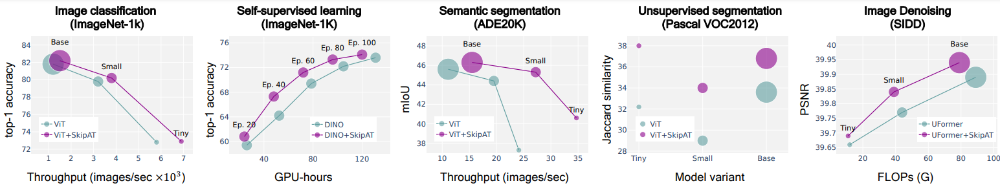

## Skip-Attention: Improving Vision Transformers by Paying Less Attention

This is the official code for ICLR 2024 paper: https://arxiv.org/abs/2301.02240

Abstract 
> This work aims to improve the efficiency of vision transformers (ViT). While ViTs use computationally expensive self-attention 
>operations in every layer, we identify that these operations are highly correlated 
>across layers – a key redundancy that causes unnecessary computations. Based on 
>this observation, we propose SKIPAT, a method to reuse self-attention computation 
>from preceding layers to approximate attention at one or more subsequent layers. 
>To ensure that reusing self-attention blocks across layers does not degrade the 
>performance, we introduce a simple parametric function, which outperforms the baseline transformer’s performance while running computationally faster. We show
the effectiveness of our method in image classification and self-supervised learning on ImageNet-1K, semantic segmentation on ADE20K, image denoising on SIDD, and
>video denoising on DAVIS. We achieve improved throughput at the same-or-higher accuracy levels in all these tasks.



The code and pretrained models in this repository allow you to replicate our results on SkipAt for Vision Transformers (ViT). It provides evaluation for image classification task on ImageNet, 
making it up to 25% faster than baseline ViT. For using it for other tasks such as unsupervised segmentation check [section 5](#other-tasks).

1. [Repo Structure](#repo-structure)
1. [Setup](#setup)
1. [Evaluating SkipAt](#evaluating-skipat)
1. [Dataset](#dataset)
1. [Other Tasks](#other-tasks)
1. [Citation](#citation)


## Repo Structure
````
/
|-- README.md               # This file
|-- requirements.txt        # Python dependencies
|-- validate.py             # Script to evaluate SkipAt
|-- utils.py                # Utils to evaluate SkipAt
|-- model/              
    |-- __init__.py
    |-- vit_skipat.py       # SkipAt model definition
    |-- uformer_utils.py    # Utils for SkipAt
|-- assets/                 # Resources for this README.md
````

## Setup
This code is experimented using `torch==1.10.1` and `timm==0.5.4`.\
First, clone the repo:
```
git clone https://github.com/Qualcomm-AI-research/skip-attention.git
cd skip-attention
```

Then, create the environment by one of following setups:

#### Using conda
The following assumes conda is installed on your machine:

```
conda create -n skipat python=3.8
conda activate skipat
pip install -r requirements.txt
```

Verify your installation by running: `python3 validate.py --help`".

#### Using venv 
The following assumes python 3.8 is installed on your machine:

```
python3.8 -m venv .venv
source .venv/bin/activate
pip install -r requirements.txt
```
Verify your installation by running: `python3 validate.py --help`".

#### Using docker
The following assumes docker v20.10 is installed on your machine:

```bash
docker run -it --rm --gpus 1 --shm-size 1G -v <..:..> python:3.8 bash
# Where locations for the code, dataset and checkpoints are mounted using `-v`.
cd <root folder of your SkipAt git clone>
python3 -m pip install -r requirements.txt
```
Verify your installation by running: `python3 validate.py --help`".


## Evaluating SkipAt
This code is verified to work with python 3.8 on Ubuntu 20.04, with Intel x86_64 CPU
and an Nvidia GeForce RTX 2080 Ti GPU, using CUDA version 10.2 and
the python dependencies specified in [requirements.txt](https://github.com/Qualcomm-AI-research/skip-attention/requirements.txt).\
Command format to evaluate our model is the same as timm's `validate` command:
```
python3 validate.py <IMAGENET_ROOT> --checkpoint <CHECKPOINTS_ROOT>/<checkpoint>.t7 --model <MODEL_TYPE> --num_classes 1000
```
Where `<IMAGENET_ROOT>` is the path to where ImageNet is stored (see [section dataset](#dataset)), `<CHECKPOINTS_ROOT>` is
the path to where model checkpoints are downloaded, and `<MODEL_TYPE>` specifies the model to use.\
For evaluation, the user can compare ViT baseline to SkipAt for *tiny*, and *small* models, 
as specified in the following table.


|    *Name*         |*<MODEL_TYPE>*|*Top-1 Acc*|*Throughput*|*Checkpoints*|
|:-------------:|:--------:|:----------:|:-----------:|:-----------:|
| ViT-T baseline |  `vit_tiny_patch16_224`      |   72.8   |  5.8   | [Link](https://github.com/Qualcomm-AI-research/skip-attention/releases/download/v1.0/vit-tiny.t7) |
| ViT-T SkipAt  |   `skipat_tiny_patch16_224`   |   73.3  |   6.9   | [Link](https://github.com/Qualcomm-AI-research/skip-attention/releases/download/v1.0/skipat-tiny.t7) |
| ViT-S baseline |  `vit_small_patch16_224`      |   79.8   | 3.2   | [Link](https://github.com/Qualcomm-AI-research/skip-attention/releases/download/v1.0/vit-small.t7) |
| ViT-S SkipAt  |   `skipat_small_patch16_224`   |   80.0  |  3.8   | [Link](https://github.com/Qualcomm-AI-research/skip-attention/releases/download/v1.0/skipat-small.t7) |


**throughput* (image/sec) is measured using a batch size of 1024 on a single NVIDIA A100 GPU, averaged over the validation set of ImageNet-1


## Dataset
This repo assumes ImageNet dataset is already downloaded in `<IMAGENET_ROOT>`. Otherwise download it from https://www.image-net.org/download.php
The data root should look like 
````
/
|-- <IMAGENET_ROOT>/              
    |-- train
    |-- val
````

## Other Tasks
SkipAt is a new model definition and can easily be used in different training paradigms and tasks including self-supervised learning and semantic segmentation. 
It achieves superior accuracy vs. efficiency tradeoff compared to the baseline transformer on a wide variety of tasks, datasets and model sizes.

 


## Citation

```
@article{venkataramanan2023skip,
  title={Skip-attention: Improving vision transformers by paying less attention},
  author={Venkataramanan, Shashanka and Ghodrati, Amir and Asano, Yuki M and Porikli, Fatih and Habibian, Amirhossein},
  journal={arXiv preprint arXiv:2301.02240},
  year={2023}
}
```
